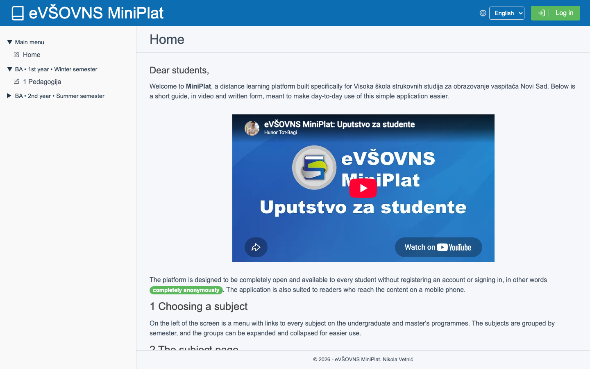
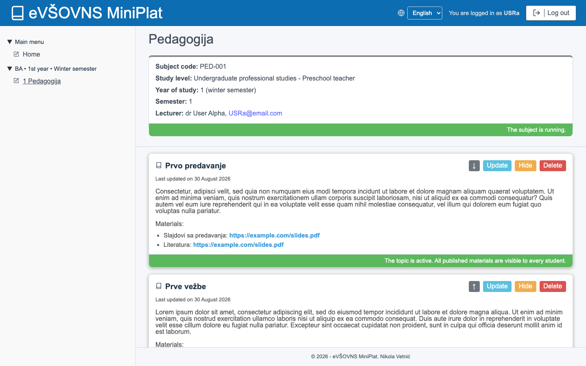
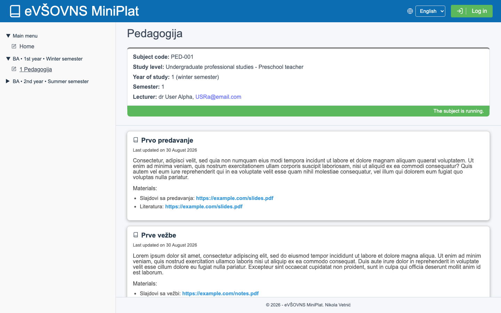
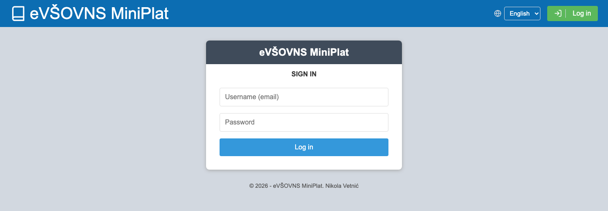
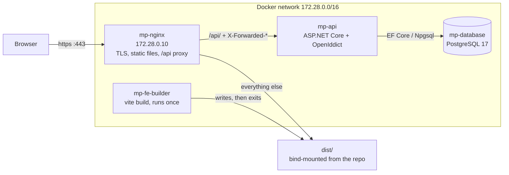
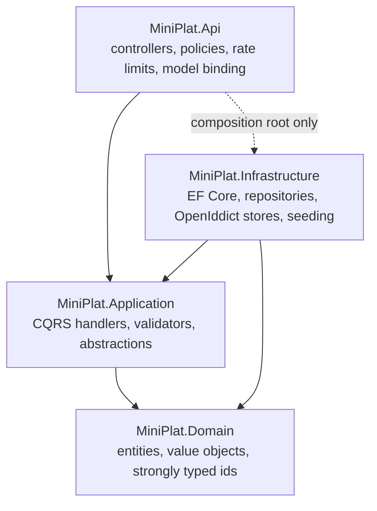
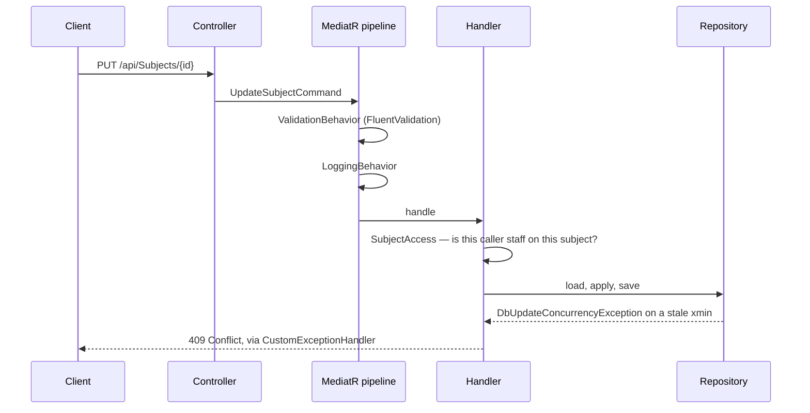

# MiniPlat

A small course platform for a preschool teachers' college: a public catalogue of subjects that anyone
can read, and an editor behind a login for the lecturers who own them.

[](https://github.com/NikolaVetnic/MiniPlat/actions/workflows/backend.yml)
[](https://github.com/NikolaVetnic/MiniPlat/actions/workflows/frontend.yml)
[](https://github.com/NikolaVetnic/MiniPlat/actions/workflows/e2e.yml)
[](https://github.com/NikolaVetnic/MiniPlat/actions/workflows/compose.yml)

.NET 10 · ASP.NET Core · EF Core · PostgreSQL · OpenIddict · React 19 · TypeScript · Vite ·
Docker Compose · nginx

## What it does

Every visitor sees the same catalogue: subjects grouped by level, year and semester, each
with its topics, descriptions and links to materials. No account is needed to read it, and
subjects that are not running are not in it.

A lecturer signs in and gets the same pages with edit affordances on the subjects they are
responsible for — rename a topic, reorder the list, hide one from students, attach a link,
put a deleted one back. An administrator gets the whole catalogue, can register accounts,
assign staff to subjects, and export the live catalogue as YAML in exactly the shape the
seeder reads back.

<p align="center">
  
  
</p>
<p align="center">
  
  
</p>

The interface is available in Serbian, Norwegian and English; the seed content in the
screenshots is Serbian, because the fixture is.

## Running it

### The whole stack, in Docker

Everything the platform needs — API, database, frontend build, reverse proxy — is one
compose project.

```bash
cd docker-compose

cp .env.template .env      # then replace every CHANGE_ME
./gen-certs.sh             # TLS for nginx, plus the OpenIddict signing/encryption pair
./up.sh                    # docker compose up -d --build
```

Then open **https://localhost**. The certificate is self-signed, so the browser will want
you to say so.

Two things about that `.env`. `gen-certs.sh` writes its `.pfx` files with the password at the
top of the script, so that value and the certificate passwords in `.env` have to agree. And
`SEED_ADMIN_PASSWORD` is not optional: the fixture's placeholder for the administrator is a
password Identity rejects, and the seeder refuses to start rather than create an
administrator whose password is in the repository. The API container will exit on the first
run if you leave it.

The stack itself needs only Docker; `gen-certs.sh` also uses `openssl` and the .NET SDK,
which is what produces the Kestrel certificate.

`./dn.sh` brings it down. The database keeps its data in the `db_vol` volume across
restarts.

What the four services do:

| Service | Image | Role |
| --- | --- | --- |
| `mp-nginx` | `nginx:stable-alpine` | Terminates TLS, serves the built bundle, proxies `/api/` to the API |
| `mp-api` | built from `Backend/…/Dockerfile` | ASP.NET Core; migrates and seeds the database on startup |
| `mp-database` | `postgres:17` | Pinned to the major version that wrote the volume — 18 will not open it |
| `mp-fe-builder` | `node:20-alpine` | Runs once, produces `dist/`, exits; nginx waits for it to finish |

### Locally, for development

First choose an administrator password, in a gitignored
`Backend/src/MiniPlat/MiniPlat.Api/appsettings.override.json`. The seeder will not start
without one, and this file is also where `Seed:FileName` points it at a catalogue of your own:

```json
{ "Seed": { "AdminUsername": "mp_admin", "AdminPassword": "Choose-One!23" } }
```

Then, in two terminals:

```bash
# 1. a database on the port appsettings.json expects
docker run -d --name miniplat-db -p 4099:5432 \
  -e POSTGRES_USER=postgres -e POSTGRES_PASSWORD=postgres -e POSTGRES_DB=MiniPlatDb \
  postgres:17

# 2. the API — migrates and seeds itself on first run
dotnet dev-certs https                                  # OpenIddict will not issue a token over http
dotnet run --project Backend/src/MiniPlat/MiniPlat.Api -lp https    # https://localhost:4101

# 3. the frontend
cd Frontend/miniplat-front && npm ci && npm run dev      # http://localhost:4010
```

The `https` launch profile matters: the token endpoint refuses to issue over a plain
connection, and in the deployed stack it is nginx that makes the connection https.

The frontend reads two variables from a gitignored `Frontend/miniplat-front/.env`:

```ini
VITE_API_BASE_URL=https://localhost:4101   # leave empty to call same-origin /api through nginx
VITE_ADMIN_USERNAME=mp_admin               # who the client treats as the administrator
```

Then sign in as `USRa` / `P@ssw0rd!123`, a lecturer with subjects to edit, or as the
administrator with the password you just chose.

## Architecture

### At runtime



The fixed proxy address is not decoration. The API partitions its rate limits on the
caller's address, which behind a proxy means trusting `X-Forwarded-For` — and trusting it
from exactly one address, because the API also publishes its own ports and traffic arriving
that way is source-translated to the gateway, inside the subnet and able to forge the
header. Trust the subnet and every client collapses into a single rate-limit bucket keyed
on nginx.

### The backend, in layers



Dependencies point inward. `Application` declares what it needs — `ISubjectsRepository`,
`ICurrentUser`, `ITokenService` — and `Infrastructure` supplies it; the only place the two
meet is `Program.cs`. `Domain` references nothing at all.

**Why bother, on a project this size?** Because of what it buys the test suite. Every
command and query handler is a class with constructor dependencies and no `DbContext`, so
the unit tests exercise real business rules — who may edit a subject, what a viewer is
allowed to see, what a validator rejects — in milliseconds and without a database. The
integration tests then cover the part that genuinely needs Postgres: the repositories, the
mapping, the endpoints end to end. Both tiers stay honest, and neither has to pretend to be
the other. On a flat controllers-and-DbContext design that split is not available: the
rules live inside methods that need a database to be reached at all.

### Requests



Cross-cutting concerns sit in the pipeline rather than in each handler: validation and
logging are open behaviours registered once, and every exception the domain raises is
translated to a `ProblemDetails` response by a single `IExceptionHandler`.

## Decisions worth explaining

**OpenIddict rather than hand-rolled JWTs.** The usual shortcut — sign a token in the login
endpoint with a symmetric key — gets you authentication and quietly skips everything around
it: refresh, expiry the client can act on, which claims belong in which token, revocation.
OpenIddict is a real OAuth2/OIDC server, so the platform gets the password grant *and* the
refresh grant, encrypted access tokens, and explicit claim destinations (email in the access
token, not the identity token). The certificates it signs and encrypts with are mounted from
disk and configured to persist, because generating them at startup would invalidate every
outstanding token on every deploy.

The grant is the resource-owner password flow, which OAuth 2.1 deprecates for good reasons.
It is the defensible choice *here*: the platform owns the client, the users and the identity
store, there is no third party, and there is no browser redirect to protect. It is also the
first thing on the list below.

**Strongly typed ids.** `SubjectId`, `TopicId`, `LecturerId` and `MaterialId` are structs
over `Guid`, not `Guid`. Passing a topic id where a subject id belongs stops compiling
instead of returning an empty result at runtime. The cost is plumbing — a model binder so a
malformed route segment answers 400 rather than 500, and JSON converters — and it is paid
once, in two small files.

**Optimistic concurrency on PostgreSQL's `xmin`.** A subject carries a `Version` mapped to
the row's system column. Two lecturers editing the same subject used to mean the slower save
silently overwrote the faster one; now the stale save is rejected and the client is told, in
its own language, to reload and redo. No extra column, no trigger.

**Soft delete with a real reaper.** A deleted topic is marked, not removed, so a lecturer
can put it back. A hosted service then purges what has been marked longer than the retention
window — otherwise "soft delete" is just a table that grows forever.

**TypeScript, migrated deliberately.** The frontend started as JavaScript and was moved over
in one pass per layer — utils, services, hooks, components, pages, entry points — with the
API contract hand-written in `src/types/api.ts` rather than generated. Several of those
commits fix a real bug the types surfaced: dates rendering as 1970, a crash on an unknown
subject, a silent failure on a conflict response.

**Three languages, one dictionary shape.** `src/i18n/types.ts` declares the shape all locale
files must have, and a test compares their key paths, so a caption added to one language and
forgotten in another fails the build rather than rendering a blank.

## The API

All paths are under `/api`. Authentication is a bearer token from the token endpoint.

| Method | Path | Who |
| --- | --- | --- |
| `POST` | `/Auth/Token` | anyone — password and refresh grants, separately rate-limited |
| `GET` | `/Auth/UserInfo` | signed in |
| `GET` | `/Subjects` | anyone — inactive subjects are filtered out |
| `GET` | `/Subjects/{id}` | anyone — hidden topics appear only for the subject's staff |
| `GET` | `/Subjects/user` | signed in — the caller's own subjects |
| `POST` | `/Subjects` | administrator |
| `PUT` | `/Subjects/{id}` | the subject's staff |
| `PUT` | `/Subjects/{id}/topics/order` | the subject's staff |
| `PATCH` | `/Subjects/{id}/topics/{topicId}` | the subject's staff |
| `PUT` | `/Subjects/{id}/staff` | administrator |
| `DELETE` | `/Subjects/{id}` | administrator |
| `GET` | `/Lecturers` | signed in |
| `GET` | `/Lecturers/{username}` | anyone |
| `POST` | `/Account/Register`, `/Account/RegisterMultiple` | administrator |
| `GET` | `/health` (no `/api` prefix) | anyone — includes a Postgres check, not rate-limited |

Rate limits are fixed windows, partitioned per client address and configurable: 1200
requests a minute overall, 30 a minute on the token endpoint where a request is a password
guess. The defaults assume a school behind a single public address, where every student
shares a partition.

In development the OpenAPI document is served at `/openapi/v1.json`.

## Tests

| Suite | Count | What it covers | Command |
| --- | --- | --- | --- |
| Backend unit | 273 | Handlers, validators, access rules, policies, value objects — no I/O | `dotnet test` |
| Backend integration | 155 | Repositories and endpoints against a real Postgres via Testcontainers | `dotnet test` |
| Frontend unit | 309 | Services, hooks, pure logic, and components via Testing Library | `npm test` |
| End-to-end | 4 | Browser → built bundle → API → Postgres | `npm run test:e2e` |

```bash
dotnet test Backend/src/MiniPlat/MiniPlat.sln     # both backend tiers; needs Docker
cd Frontend/miniplat-front
npm test                                          # vitest
npm run test:e2e                                  # playwright; needs Docker and dotnet dev-certs https
npm run screenshots                               # regenerates docs/screenshots/
```

The end-to-end run starts everything itself — a throwaway Postgres container, the API in
Release, and a preview server on a bundle built to a separate directory — and removes the
container afterwards. It deliberately tests joins rather than logic: that the bundle talks
to the API that is running, that a token OpenIddict issued is accepted on the next call, and
that an edit is still there after a reload.

Four workflows run in CI, each scoped by path so a frontend change does not rebuild the
solution: `backend.yml` (build, both test tiers, and a Docker image build that catches a
Dockerfile out of step with the solution), `frontend.yml` (lint, typecheck, test, build on
Node 20 — the version the deployed bundle is built with), `e2e.yml` (the smoke paths, with
Playwright traces uploaded on failure), and `compose.yml` (validates the compose files
against `.env.template`, which also catches the template drifting from what the files
reference).

## Layout

```
Backend/src/MiniPlat/
  MiniPlat.Domain/           entities, value objects, strongly typed ids
  MiniPlat.Application/      CQRS handlers, validators, pipeline behaviours, abstractions
  MiniPlat.Infrastructure/   EF Core, migrations, repositories, seeding, background services
  MiniPlat.Api/              controllers, authorization policies, rate limiting, composition
  MiniPlat.UnitTests/
  MiniPlat.IntegrationTests/

Frontend/miniplat-front/
  src/components/  src/pages/  src/hooks/  src/contexts/
  src/services/              the only modules that talk to the API
  src/i18n/  src/locales/    dictionary shape, and sr / no / en
  src/types/api.ts           the API contract, hand-written
  e2e/                       Playwright smoke paths and the README's screenshots

docker-compose/              the deployable stack, nginx config, certificate scripts
.github/workflows/           backend, frontend, e2e, compose
```

## About the data

The catalogue this platform was built for belongs to a real institution, and it is not in
this repository. `initialData.yml` — the fixture that ships, and what the seeder falls back
to when nothing else is configured — is fictional: four invented accounts, a handful of
subjects, lorem ipsum descriptions. The real export is gitignored, and pointed at through
`Seed:FileName` in a gitignored override file when the platform is actually deployed.

The administrator's password is not in the fixture either, and its absence is enforced rather
than merely intended: the placeholder the file carries is one Identity rejects, so a
deployment that does not choose a password is refused at startup instead of coming up with an
administrator whose credentials are on GitHub. `Seed:AdminPassword` supplies it — through
`appsettings.override.json` locally, or `SEED_ADMIN_PASSWORD` in `.env` under compose.
Certificates, `.env` files and `appsettings.override.json` are all gitignored, and
`.env.template` carries the variable names with `CHANGE_ME` values so the compose files can
still be validated in CI.

The administrator's YAML export writes the same shape the seeder reads, so a running
deployment can produce the fixture that reseeds it.

## What I would do next

- **Move off the password grant.** Authorization code with PKCE, so credentials never reach
  the client, and the door is open to an institutional identity provider later.
- **Tighten CORS at the edge.** `nginx.conf` answers `Access-Control-Allow-Origin *` on both
  locations; the API already keeps an explicit origin list and the proxy should not be
  looser than what it fronts.
- **Materials as first-class content.** Today a material is a link. Uploads — with storage,
  size limits and virus scanning — are the obvious next feature and the one that changes the
  infrastructure most.
- **Observability past logging.** Structured logs go to stdout and that is all; OpenTelemetry
  traces and a metrics endpoint would make the rate limiter and the cleanup job observable
  rather than inferable.
- **Deployment.** CI builds the API image and pushes nothing. A registry push and a
  pull-and-restart on the host would close the gap between a green build and a running one.
- **Push the frontend fetching into a cache layer.** Hand-rolled hooks over `fetch` are
  fine at four screens; they will not stay fine, and refetch-on-focus and shared cache keys
  are what they will need first.
